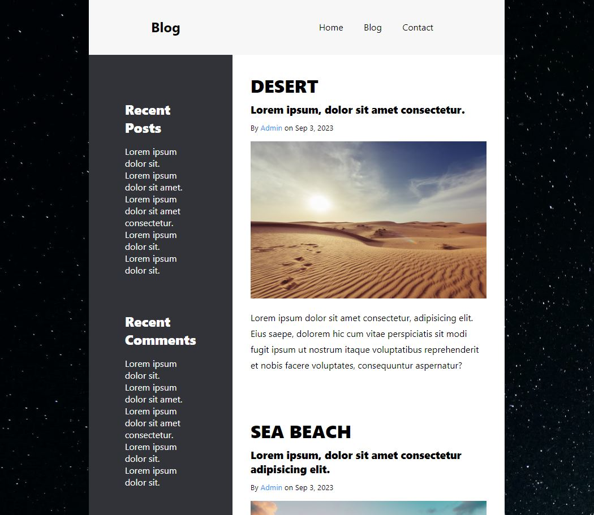

# Blog Project

## Description

I developed this simple blog website to enhance my skills in HTML, CSS, and JavaScript. The primary goal was to create a responsive and visually appealing blog layout, incorporating CSS Grid for the design and a minimalistic JavaScript-based hamburger menu for mobile devices.

### Table of Contents

- [Installation](#installation)
- [Usage](#usage)
- [Technologies Used](#technologies-used)
- [Credits](#credits)
- [License](#license)



## Installation

To run this project locally, follow these steps:

1. Clone the repository to your local machine.
    ```bash
    git clone https://github.com/ramzancodeclub/Blog.git
    ```

2. Open the project folder in your code editor.

3. Open the `index.html` file in your web browser.

## Usage

Explore the blog website:

1. Open the [live demo](https://blog-rouge-zeta.vercel.app/) or run it locally.

2. Navigate through the blog posts and enjoy the responsive layout.

## Technologies Used

- HTML
- CSS (including CSS Grid)
- JavaScript

## Credits

- [Muhammad Ramzan](https://github.com/ramzancodeclub) - Project Creator

## License

This project is licensed under the [MIT License](LICENSE).

---

## Badges


## Features

- Responsive design with CSS Grid
- Minimalistic hamburger menu for mobile devices
- Clean and readable blog layout

## How to Contribute

If you'd like to contribute to the project, follow these steps:

1. Fork the project.
2. Create a new branch for your feature: `git checkout -b feature-name`.
3. Commit your changes: `git commit -m 'Add new feature'`.
4. Push to the branch: `git push origin feature-name`.
5. Open a pull request.

## Tests

The project includes a set of tests to ensure the functionality is working as expected. To run the tests, use the following command:
```bash
npm test
